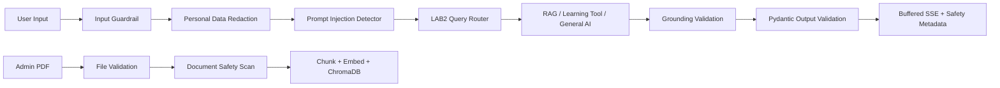
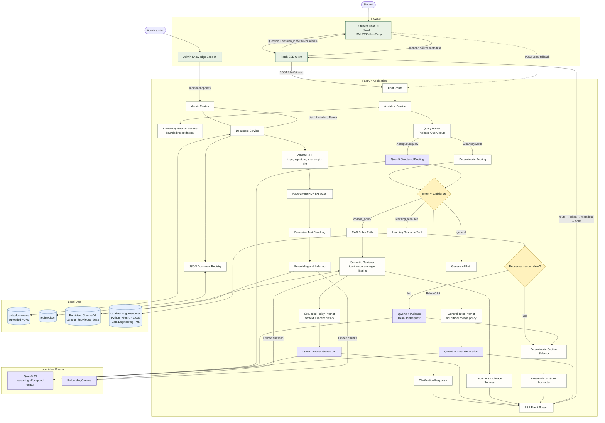
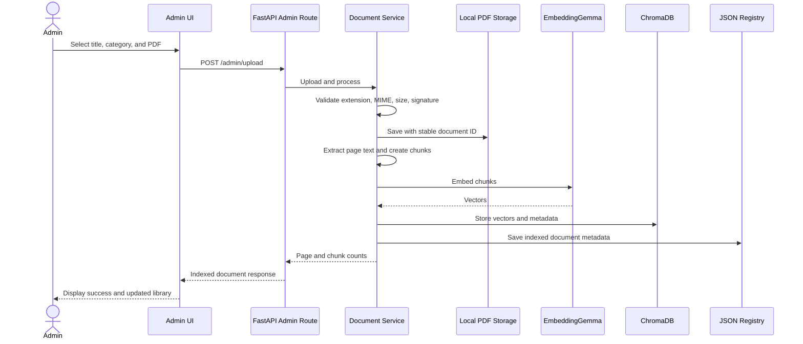
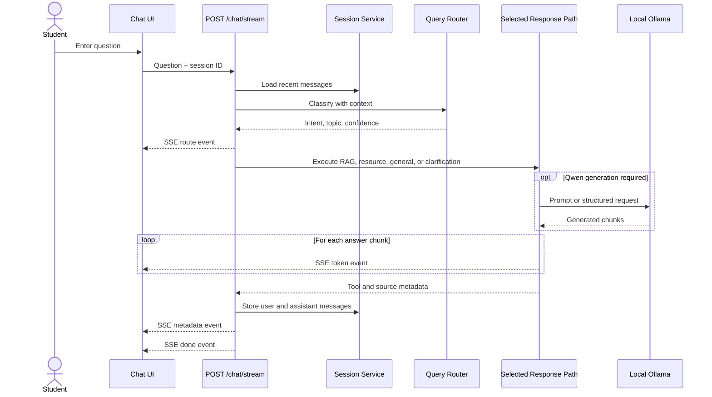

# Campus AI Assistant — LAB1 + LAB2 Architecture

This diagram represents the application completed through LAB3. The LAB1/LAB2 flow below is wrapped
by the following LAB3 defense-in-depth pipeline.

## Route summary

| Route | Selected for | Primary data source | Qwen3 usage | Grounded as policy |
|---|---|---|---|---|
| College Policy RAG | Attendance, exams, placements, internships | Uploaded PDFs in ChromaDB | Generates from retrieved chunks | Yes |
| Learning Resource Tool | Roadmaps and learning plans | Local learning-resource JSON | Classifies unclear requested sections only | No |
| General AI | General explanations | Qwen3 pretrained knowledge | Generates the complete answer | No |
| Clarification | Route confidence below `0.65` | Deterministic options | Not required | No |

## Admin ingestion sequence

## Student streaming sequence

